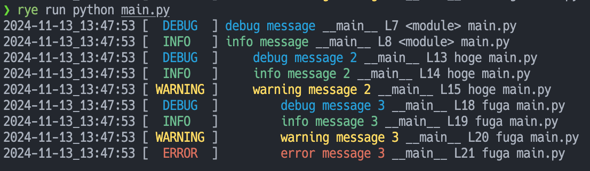
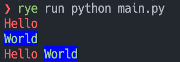

# utils

My Utils

### clogging.py: A simple colored logging module for Python
    
```python
from utils.clogging import getColoredLogger, ColoredFileHandler

logger = getColoredLogger(__name__)
logger.addHandler(ColoredFileHandler('test.log'))

logger.setLevel('DEBUG')
logger.debug('debug message')
logger.info('info message')


def hoge():
    logger.debug('debug message 2')
    logger.info('info message 2')
    logger.warning('warning message 2')

    def fuga():
        logger.debug('debug message 3')
        logger.info('info message 3')
        logger.warning('warning message 3')
        logger.error('error message 3')

    fuga()

hoge()
```


### colors.py: A simple color module for Python

```python
from utils.colors import ColorCode, ColoredStr

s = ColoredStr('Hello', fg=ColorCode.RED)
t = ColoredStr('World', fg=ColorCode.GREEN, bg=ColorCode.BLUE)
print(s)
print(t)
print(s + ' ' + t)
```



### dummy.py: A dummy module for anything
DummyObject is a dummy object that can be used for anything. It can be used as a dummy object for testing, a dummy object for a placeholder, a dummy object for a temporary object, etc.
```python
from utils.dummy import DummyObject

dummy = DummyObject()

dummy.log("Hello, World!")
dummy = dummy + 1
dummy = dummy.append(1)
dummy = dummy[1:2] * 2
dummy = dummy << 1
dummy.dummy.dummy.dummy()
dummy = next(dummy)

with dummy as d:
    for dummy_child in dummy:
        break

    while dummy:
        break

    if dummy:
        ...

    try:
        ...
    except dummy:
        ...

    match dummy:
        case 0:
            ...
        case _:
            ...


async def async_dummy():
    async with dummy as d:
        ...
        return dummy


async def call_async_dummy():
    await async_dummy()


dummy -= dummy
dummy += dummy
dummy &= dummy

assert dummy != dummy
assert dummy == dummy

assert dummy < dummy
assert dummy > dummy


import asyncio

asyncio.run(call_async_dummy())
```

